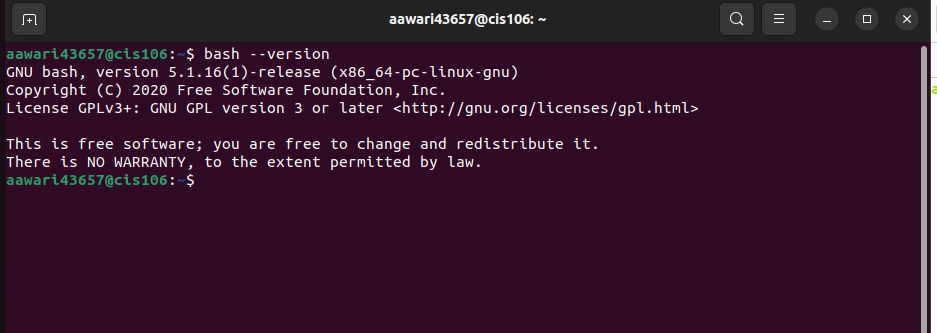
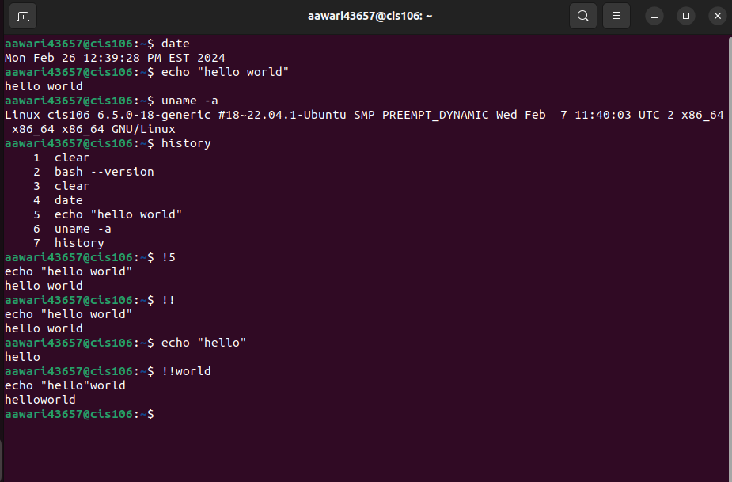
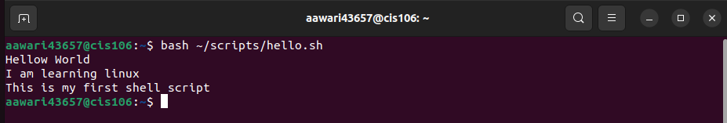
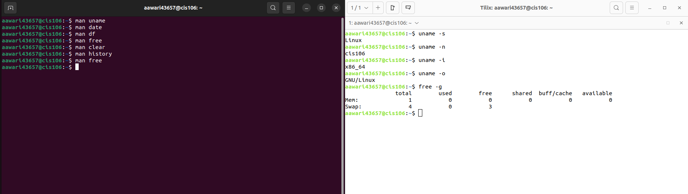
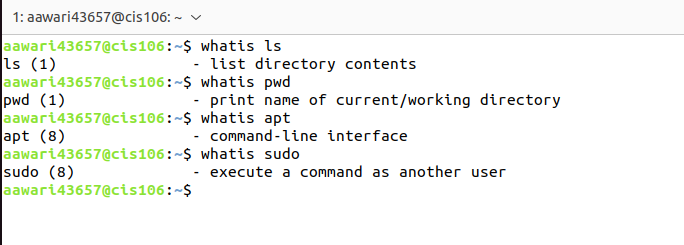
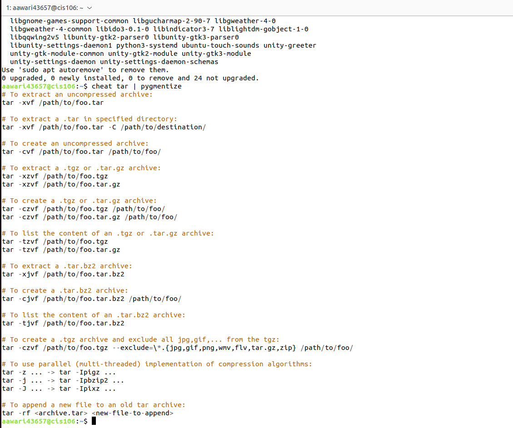
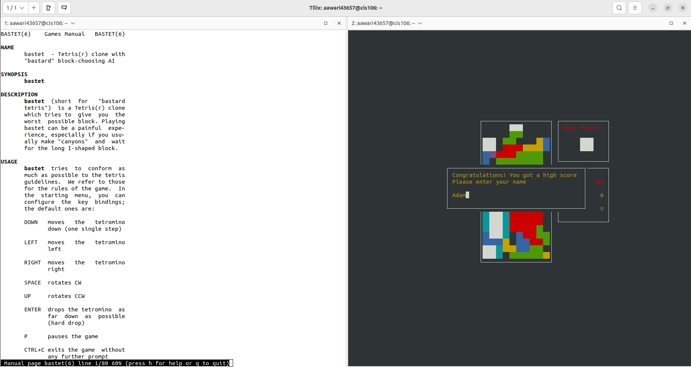
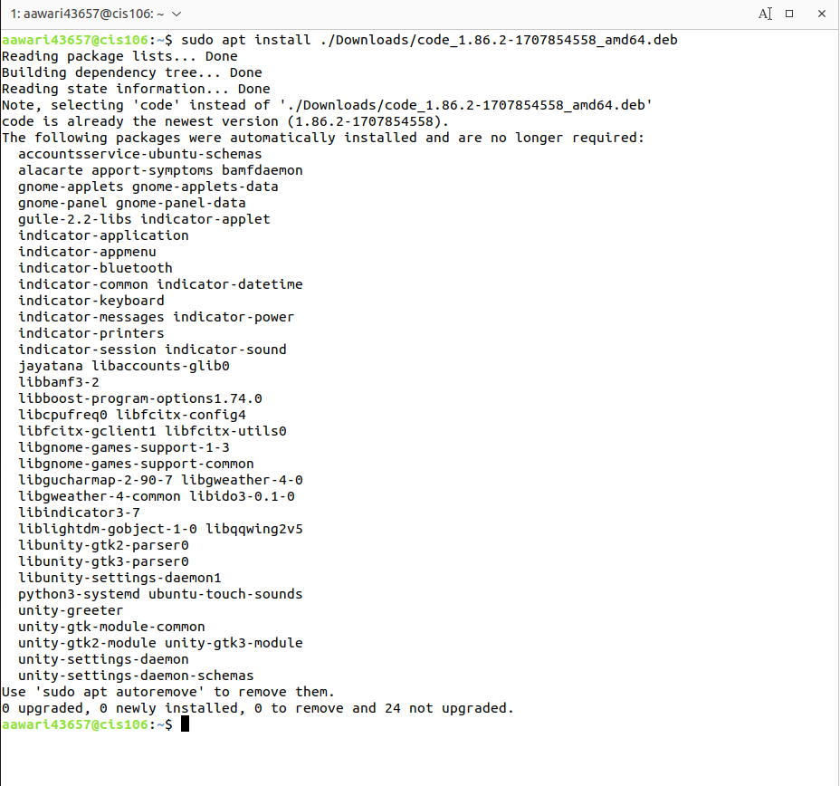
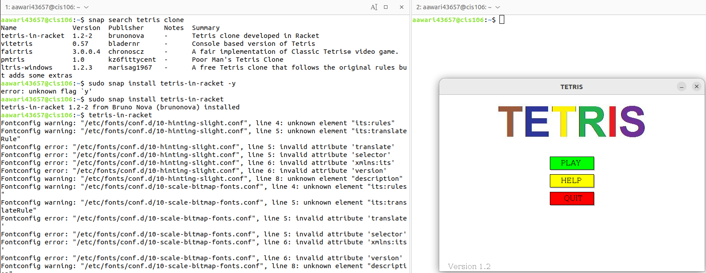

# Week Report 3
## Completed work for Week 3
[Lab3](https://github.com/PcccAdamA/cis106/blob/main/labs/lab3/lab3.md)
[Notes1](https://github.com/PcccAdamA/cis106/blob/main/notes/notes1/notes1.md)

## Bash Shell Practices
### Practice 2

### Practice 3

### Practice 4

### Practice 5

### Practice 6

### Practice 7

## Managing Software Practices
### Practice 1

### Practice 2

### Practice 3
